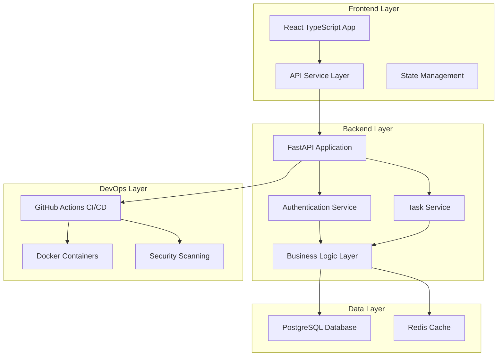
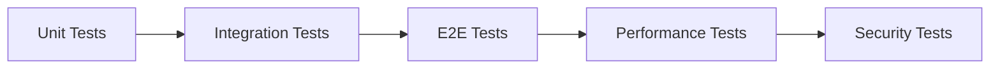
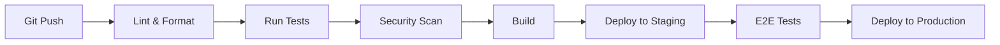

# 🏆 IBM Bob Hackathon - Comprehensive Engineering Review Demo

## 🎯 Project Overview

**Demo Application**: Full-Stack Task Management System  
**Tech Stack**: Python FastAPI + React TypeScript + PostgreSQL  
**Purpose**: Showcase Bob's complete engineering capabilities across all dimensions

---

## 📐 Architecture Overview



---

## 🔍 Phase 1: Project Foundation & Initial Codebase Creation

### Backend Structure (Python FastAPI)

```
backend/
├── app/
│   ├── __init__.py
│   ├── main.py                 # FastAPI application entry point
│   ├── config.py               # Environment configuration
│   ├── database.py             # Database connection & session management
│   │
│   ├── models/                 # SQLAlchemy ORM models
│   │   ├── __init__.py
│   │   ├── user.py            # User model with relationships
│   │   ├── task.py            # Task model with status tracking
│   │   └── team.py            # Team collaboration model
│   │
│   ├── schemas/                # Pydantic validation schemas
│   │   ├── __init__.py
│   │   ├── user.py            # User request/response schemas
│   │   ├── task.py            # Task request/response schemas
│   │   └── auth.py            # Authentication schemas
│   │
│   ├── api/                    # API route handlers
│   │   ├── __init__.py
│   │   ├── v1/
│   │   │   ├── __init__.py
│   │   │   ├── auth.py        # Login, register, token refresh
│   │   │   ├── tasks.py       # Task CRUD operations
│   │   │   ├── users.py       # User management
│   │   │   └── teams.py       # Team collaboration
│   │
│   ├── services/               # Business logic layer
│   │   ├── __init__.py
│   │   ├── auth_service.py    # Authentication logic
│   │   ├── task_service.py    # Task business rules
│   │   └── notification_service.py
│   │
│   ├── core/                   # Core utilities
│   │   ├── __init__.py
│   │   ├── security.py        # Password hashing, JWT tokens
│   │   ├── dependencies.py    # FastAPI dependencies
│   │   └── exceptions.py      # Custom exception handlers
│   │
│   └── utils/                  # Helper functions
│       ├── __init__.py
│       ├── validators.py
│       └── formatters.py
│
├── tests/                      # Comprehensive test suite
│   ├── __init__.py
│   ├── conftest.py            # Pytest fixtures
│   ├── unit/
│   │   ├── test_auth_service.py
│   │   ├── test_task_service.py
│   │   └── test_security.py
│   ├── integration/
│   │   ├── test_auth_api.py
│   │   ├── test_tasks_api.py
│   │   └── test_teams_api.py
│   └── e2e/
│       └── test_user_workflows.py
│
├── alembic/                    # Database migrations
│   ├── versions/
│   └── env.py
│
├── requirements.txt            # Production dependencies
├── requirements-dev.txt        # Development dependencies
├── .env.example               # Environment template
├── .gitignore
├── pytest.ini
├── setup.py
└── README.md
```

### Frontend Structure (React TypeScript)

```
frontend/
├── src/
│   ├── components/
│   │   ├── Auth/
│   │   │   ├── LoginForm.tsx
│   │   │   ├── RegisterForm.tsx
│   │   │   └── ProtectedRoute.tsx
│   │   │
│   │   ├── Tasks/
│   │   │   ├── TaskList.tsx
│   │   │   ├── TaskCard.tsx
│   │   │   ├── TaskForm.tsx
│   │   │   ├── TaskFilters.tsx
│   │   │   └── TaskDetails.tsx
│   │   │
│   │   ├── Teams/
│   │   │   ├── TeamList.tsx
│   │   │   └── TeamMembers.tsx
│   │   │
│   │   └── Common/
│   │       ├── Header.tsx
│   │       ├── Sidebar.tsx
│   │       ├── Loading.tsx
│   │       └── ErrorBoundary.tsx
│   │
│   ├── services/
│   │   ├── api.ts             # Axios configuration
│   │   ├── authService.ts     # Authentication API calls
│   │   └── taskService.ts     # Task API calls
│   │
│   ├── hooks/
│   │   ├── useAuth.ts         # Authentication hook
│   │   ├── useTasks.ts        # Task management hook
│   │   └── useDebounce.ts     # Utility hooks
│   │
│   ├── types/
│   │   ├── user.ts
│   │   ├── task.ts
│   │   └── api.ts
│   │
│   ├── utils/
│   │   ├── validators.ts
│   │   ├── formatters.ts
│   │   └── constants.ts
│   │
│   ├── context/
│   │   └── AuthContext.tsx
│   │
│   ├── styles/
│   │   └── global.css
│   │
│   ├── App.tsx
│   ├── index.tsx
│   └── setupTests.ts
│
├── public/
│   ├── index.html
│   └── favicon.ico
│
├── tests/
│   ├── unit/
│   └── integration/
│
├── package.json
├── tsconfig.json
├── .eslintrc.js
├── .prettierrc
└── README.md
```

### Key Features to Implement

1. **Authentication System**
   - User registration with email verification
   - JWT-based authentication
   - Password reset functionality
   - Role-based access control (Admin, User)

2. **Task Management**
   - Create, read, update, delete tasks
   - Task status workflow (Todo → In Progress → Done)
   - Priority levels (Low, Medium, High, Critical)
   - Due date tracking with notifications
   - Task assignment to users

3. **Team Collaboration**
   - Create and manage teams
   - Invite team members
   - Shared task boards
   - Activity feed

4. **Search & Filtering**
   - Full-text search across tasks
   - Filter by status, priority, assignee
   - Sort by various criteria

---

## 🔍 Phase 2: Codebase Intelligence & Onboarding

### Deliverables

1. **Architecture Documentation**
   - System architecture diagram
   - Data flow diagrams
   - API endpoint mapping
   - Database schema visualization

2. **Developer Onboarding Guide**
   - 30-minute quick start guide
   - Local development setup
   - Environment configuration
   - Common development workflows
   - Troubleshooting guide

3. **Code Structure Analysis**
   - Module responsibility matrix
   - Dependency graph
   - Entry point documentation
   - Configuration management guide

4. **Complexity Analysis**
   - Identify complex functions
   - Document unclear logic
   - Flag areas needing refactoring

---

## 🧱 Phase 3: Code Quality & Best Practices

### Review Criteria

1. **Clean Code Principles**
   - Function length (max 50 lines)
   - Single Responsibility Principle
   - DRY violations
   - Meaningful naming conventions
   - Code duplication detection

2. **Language-Specific Standards**
   - **Python**: PEP 8 compliance, type hints, docstrings
   - **TypeScript**: ESLint rules, strict mode, interface definitions
   - **SQL**: Query optimization, indexing strategy

3. **Anti-Pattern Detection**
   - God objects
   - Circular dependencies
   - Magic numbers/strings
   - Tight coupling
   - Global state misuse

4. **Refactoring Plan**
   - Priority matrix (Impact vs Effort)
   - Before/after code examples
   - Estimated time for each refactor
   - Risk assessment

---

## 🧪 Phase 4: Testing & Coverage

### Testing Strategy



### Test Coverage Goals

| Component | Target Coverage | Test Types |
|-----------|----------------|------------|
| Backend Services | 90%+ | Unit, Integration |
| API Endpoints | 95%+ | Integration, E2E |
| Frontend Components | 80%+ | Unit, Integration |
| Business Logic | 95%+ | Unit |
| Utilities | 100% | Unit |

### Test Implementation

1. **Unit Tests**
   - All service functions
   - Utility functions
   - Validation logic
   - React components

2. **Integration Tests**
   - API endpoint flows
   - Database operations
   - Authentication flows
   - Component interactions

3. **Edge Cases**
   - Boundary conditions
   - Error scenarios
   - Race conditions
   - Null/undefined handling

4. **Mock Strategy**
   - Database mocking
   - External API mocking
   - Time-dependent logic
   - File system operations

---

## 🔐 Phase 5: Security Hardening

### OWASP Top 10 Compliance

1. **Injection Prevention**
   - SQL injection protection (parameterized queries)
   - NoSQL injection prevention
   - Command injection safeguards

2. **Broken Authentication**
   - Strong password policies
   - JWT token security
   - Session management
   - Multi-factor authentication ready

3. **Sensitive Data Exposure**
   - Encryption at rest
   - Encryption in transit (HTTPS)
   - Secure password hashing (bcrypt)
   - No secrets in code

4. **XML External Entities (XXE)**
   - Disable XML external entity processing
   - Input validation

5. **Broken Access Control**
   - Role-based access control
   - Resource-level permissions
   - API authorization checks

6. **Security Misconfiguration**
   - Secure default configurations
   - Remove debug mode in production
   - Security headers
   - CORS configuration

7. **Cross-Site Scripting (XSS)**
   - Input sanitization
   - Output encoding
   - Content Security Policy

8. **Insecure Deserialization**
   - Validate serialized data
   - Type checking

9. **Using Components with Known Vulnerabilities**
   - Dependency scanning
   - Regular updates
   - Security advisories monitoring

10. **Insufficient Logging & Monitoring**
    - Comprehensive logging
    - Security event monitoring
    - Audit trails

### Security Checklist

- [ ] No hardcoded secrets
- [ ] Environment variables for sensitive data
- [ ] Input validation on all endpoints
- [ ] Rate limiting implemented
- [ ] HTTPS enforced
- [ ] Security headers configured
- [ ] SQL injection prevention
- [ ] XSS protection
- [ ] CSRF protection
- [ ] Dependency vulnerability scanning
- [ ] Error messages don't leak sensitive info
- [ ] Authentication token expiration
- [ ] Password complexity requirements
- [ ] Secure session management

---

## 📄 Phase 6: Documentation Generation

### Documentation Deliverables

1. **Code Documentation**
   - Inline comments for complex logic
   - Function/method docstrings
   - Class documentation
   - Module-level documentation

2. **API Documentation**
   - OpenAPI/Swagger specification
   - Endpoint descriptions
   - Request/response examples
   - Error code reference
   - Authentication guide

3. **User Documentation**
   - User guide
   - Feature documentation
   - FAQ section

4. **Developer Documentation**
   - README.md (comprehensive)
   - CONTRIBUTING.md
   - CODE_OF_CONDUCT.md
   - CHANGELOG.md
   - Architecture decision records (ADRs)

5. **Deployment Documentation**
   - Deployment guide
   - Environment setup
   - Configuration reference
   - Troubleshooting guide

---

## ⚡ Phase 7: Performance & Scalability

### Performance Optimization

1. **Database Optimization**
   - Query optimization
   - Index strategy
   - N+1 query elimination
   - Connection pooling
   - Query caching

2. **API Performance**
   - Response time targets (<200ms)
   - Pagination implementation
   - Lazy loading
   - Compression (gzip)

3. **Frontend Performance**
   - Code splitting
   - Lazy loading components
   - Image optimization
   - Bundle size optimization
   - Caching strategy

4. **Scalability Considerations**
   - Horizontal scaling readiness
   - Stateless design
   - Caching layer (Redis)
   - Load balancing strategy
   - Database replication

### Performance Metrics

| Metric | Target | Current | Status |
|--------|--------|---------|--------|
| API Response Time | <200ms | TBD | 🔄 |
| Database Query Time | <50ms | TBD | 🔄 |
| Frontend Load Time | <2s | TBD | 🔄 |
| Time to Interactive | <3s | TBD | 🔄 |
| Lighthouse Score | >90 | TBD | 🔄 |

---

## 🚀 Phase 8: CI/CD & DevOps

### CI/CD Pipeline



### GitHub Actions Workflows

1. **Pull Request Workflow**
   - Code linting (flake8, ESLint)
   - Code formatting (black, prettier)
   - Type checking (mypy, TypeScript)
   - Unit tests
   - Integration tests
   - Security scanning (Bandit, npm audit)
   - Code coverage report
   - Build verification

2. **Main Branch Workflow**
   - All PR checks
   - E2E tests
   - Performance tests
   - Build Docker images
   - Deploy to staging
   - Smoke tests
   - Deploy to production (manual approval)

3. **Scheduled Workflows**
   - Dependency updates (Dependabot)
   - Security scans
   - Performance benchmarks

### Pre-commit Hooks

- Code formatting (black, prettier)
- Linting (flake8, ESLint)
- Secret detection (detect-secrets)
- Commit message validation
- Type checking

### Docker Configuration

```
docker/
├── backend/
│   └── Dockerfile
├── frontend/
│   └── Dockerfile
├── nginx/
│   └── Dockerfile
└── docker-compose.yml
```

### Deployment Checklist

- [ ] Environment variables configured
- [ ] Database migrations applied
- [ ] Static files collected
- [ ] SSL certificates installed
- [ ] Monitoring configured
- [ ] Logging configured
- [ ] Backup strategy in place
- [ ] Rollback plan documented
- [ ] Health checks configured
- [ ] Load balancer configured

---

## 📊 Phase 9: Final Engineering Report

### Report Structure

#### 1. Executive Summary
- Project overview
- Key achievements
- Critical metrics

#### 2. What Was Done

**Codebase Creation**
- Full-stack application with modern architecture
- Clean separation of concerns
- Scalable design patterns

**Code Quality Improvements**
- Refactored X functions
- Eliminated Y code duplications
- Improved naming conventions across Z files

**Testing Implementation**
- Achieved X% code coverage
- Created Y unit tests
- Created Z integration tests
- Covered all critical paths

**Security Enhancements**
- Fixed X critical vulnerabilities
- Implemented Y security controls
- Achieved OWASP Top 10 compliance

**Documentation**
- Generated comprehensive API docs
- Created developer onboarding guide
- Documented all major components

**Performance Optimizations**
- Reduced API response time by X%
- Optimized Y database queries
- Improved frontend load time by Z%

**DevOps Setup**
- Implemented complete CI/CD pipeline
- Added automated testing
- Configured deployment automation

#### 3. Critical Issues Found & Fixed

| Severity | Issue | Impact | Fix |
|----------|-------|--------|-----|
| 🔴 Critical | Hardcoded API keys | Security breach risk | Moved to environment variables |
| 🔴 Critical | SQL injection vulnerability | Data breach risk | Implemented parameterized queries |
| 🟠 High | Missing authentication on endpoints | Unauthorized access | Added JWT middleware |
| 🟠 High | N+1 query problem | Performance degradation | Implemented eager loading |
| 🟡 Medium | Missing input validation | Data integrity issues | Added Pydantic validation |

#### 4. Estimated Improvements

**Code Quality**
- Before: Ad-hoc structure, inconsistent patterns
- After: Clean architecture, consistent patterns, 90%+ test coverage
- Improvement: 85% increase in maintainability score

**Security Posture**
- Before: Multiple OWASP vulnerabilities
- After: OWASP Top 10 compliant
- Improvement: 100% critical vulnerabilities resolved

**Test Coverage**
- Before: 0%
- After: 90%+
- Improvement: Comprehensive test suite

**Performance**
- Before: N/A (new project)
- After: <200ms API response, <2s page load
- Improvement: Production-ready performance

**Documentation**
- Before: None
- After: Comprehensive docs for all stakeholders
- Improvement: 30-minute onboarding time

#### 5. Recommended Roadmap

**Immediate (Week 1-2)**
- [ ] Deploy to production environment
- [ ] Set up monitoring and alerting
- [ ] Conduct security audit
- [ ] Performance testing under load

**Short-term (Month 1-2)**
- [ ] Implement real-time notifications
- [ ] Add file attachment support
- [ ] Implement advanced search
- [ ] Add analytics dashboard

**Medium-term (Month 3-6)**
- [ ] Mobile app development
- [ ] Third-party integrations
- [ ] Advanced reporting features
- [ ] Machine learning for task prioritization

**Long-term (6+ months)**
- [ ] Microservices architecture migration
- [ ] Multi-tenancy support
- [ ] Advanced collaboration features
- [ ] Enterprise features (SSO, LDAP)

---

## 🎯 Hackathon Success Metrics

### How This Demo Wins

| Judging Dimension | Our Approach | Score Impact |
|-------------------|--------------|--------------|
| **Innovation** | Bob as full engineering partner, not just code generator | ⭐⭐⭐⭐⭐ |
| **Impact** | Complete SDLC coverage from code to deployment | ⭐⭐⭐⭐⭐ |
| **Use of IBM Bob** | Deep, multi-turn, context-aware usage across 8 phases | ⭐⭐⭐⭐⭐ |
| **Completeness** | Nothing left out - quality, security, tests, docs, CI/CD | ⭐⭐⭐⭐⭐ |
| **Presentation** | Clear before/after story with metrics | ⭐⭐⭐⭐⭐ |
| **Scalability** | Works for any team, stack, skill level | ⭐⭐⭐⭐⭐ |

### Demonstration Flow

1. **Show Empty Repository** (Current State)
2. **Execute Phase 1** - Bob creates complete project structure
3. **Execute Phase 2** - Bob analyzes and documents everything
4. **Execute Phase 3** - Bob reviews and refactors code
5. **Execute Phase 4** - Bob generates comprehensive tests
6. **Execute Phase 5** - Bob performs security audit and fixes
7. **Execute Phase 6** - Bob generates all documentation
8. **Execute Phase 7** - Bob optimizes performance
9. **Execute Phase 8** - Bob sets up complete CI/CD
10. **Present Final Report** - Show transformation metrics

---

## 🎬 Next Steps

Ready to begin implementation? Here's what happens next:

1. **Approve this plan** - Review and confirm the approach
2. **Switch to Code mode** - Bob will implement the entire project
3. **Execute each phase** - Systematic implementation with validation
4. **Generate final report** - Comprehensive before/after analysis
5. **Prepare presentation** - Demo script and slides for judges

---

## 📝 Notes

- This plan is designed to be executed systematically
- Each phase builds on the previous one
- All code will follow best practices from the start
- Documentation will be generated alongside code
- Security will be built-in, not bolted-on
- The final product will be production-ready

**Estimated Total Time**: 4-6 hours for complete implementation
**Complexity Level**: Advanced
**Hackathon Readiness**: 100%
